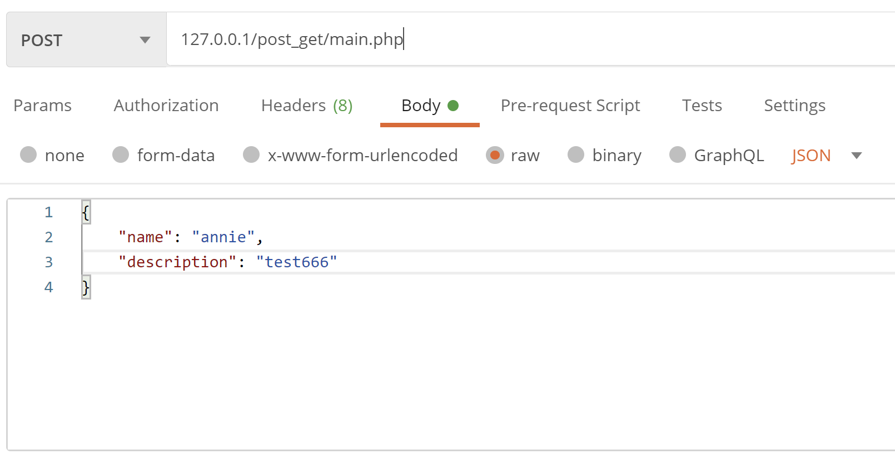
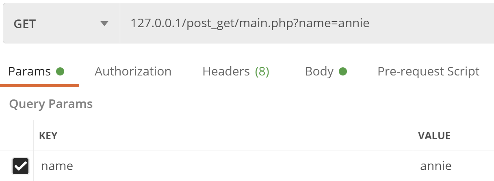

# crud
使用php實作crud功能

# PHP-CRUD

資料庫：project

資料表：crud

資料內容：id, name, description, created_at, updated_at

資料傳遞格式：(POSTMAN範例)

POST/PUT    :  json



GET/DELETE : query



目標 : main.php

- Create  ⇒ 創建使用者

    參數：name, description

    成功：

    ```php
    {
        "status": "success",
        "data": [
            null
        ]
    }
    ```

    失敗 : 

    1. 參數缺漏

        ```php
        {
            "status": "error",
            "message": "Parameter is wrong"
        }
        ```

    2. 使用者已存在

        ```php
        {
            "status": "error",
            "message": "user is exist"
        }
        ```

- Read    ⇒ 讀取使用者資訊

    參數：name

    成功：

    ```php
    {
        "status": "success",
        "data": [
            null
        ]
    }
    ```

    失敗 : 

    1. 參數缺漏

        ```php
        {
            "status": "error",
            "message": "Parameter is wrong"
        }
        ```

    2. 使用者已存在

        ```php
        {
            "status": "error",
            "message": "user is exist"
        }
        ```

- Update⇒ 更新使用者資訊

    參數：name, description

    成功：

    ```php
    {
        "status": "success",
        "data": [
            null
        ]
    }
    ```

    失敗 : 

    1. 參數缺漏

        ```php
        {
            "status": "error",
            "message": "Parameter is wrong"
        }
        ```

    2. 使用者已存在

        ```php
        {
            "status": "error",
            "message": "user is exist"
        }
        ```

- Delete ⇒ 刪除使用者資訊

    參數：name

    成功：

    ```php
    {
        "status": "success",
        "data": [
            null
        ]
    }
    ```

    失敗 : 

    1. 參數缺漏

        ```php
        {
            "status": "error",
            "message": "Parameter is wrong"
        }
        ```

    2. 使用者已存在

        ```php
        {
            "status": "error",
            "message": "user is exist"
        }
        ```
